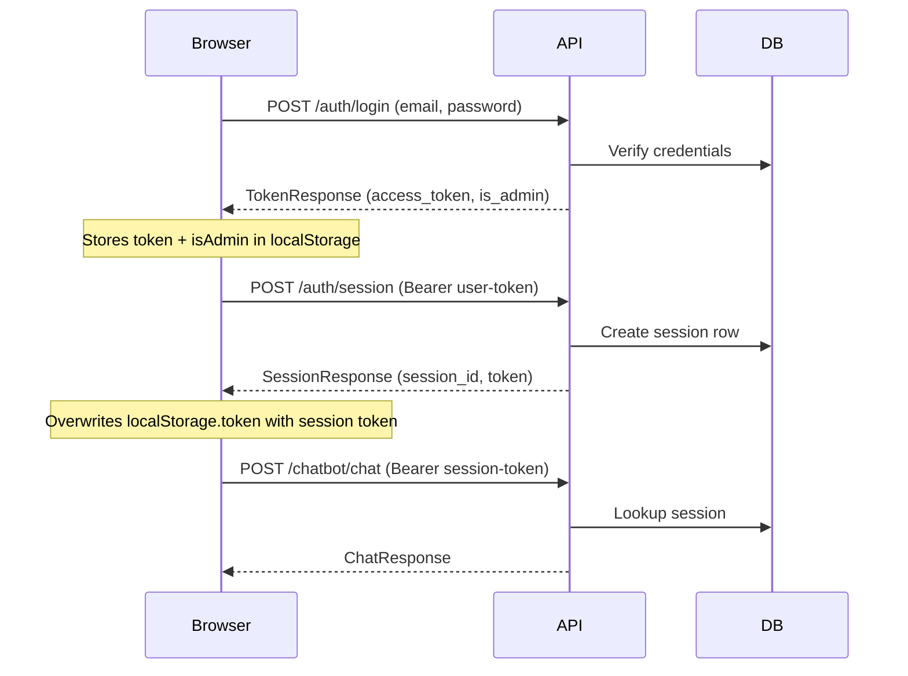

# Auth redesign: JWT hardening

**Status:** Proposed  
**Related docs:** [System design](../DESIGN.md) | [Backend design](../backend/DESIGN.md) | [Implementation guide](./auth-redesign-implementation.md)

---

## 1. Motivation

An architecture review surfaced four critical security flaws in the current JWT-based authentication system:

| # | Issue | Severity | Root cause |
|---|-------|----------|------------|
| 1 | **Untyped tokens** | Critical | User tokens (`sub` = user ID) and session tokens (`sub` = session UUID) share the same structure. `get_current_admin_user` explicitly accepts both, so any valid token with an admin-owned subject grants admin access. |
| 2 | **No revocation / 30-day expiry** | High (residual) | Tokens cannot be invalidated server-side. `logout()` only clears `localStorage`; the token remains valid until expiry. There is no blocklist or refresh flow. Mitigated in this change by reducing session token lifetime from 30 days to 7 days; full revocation deferred to future work. |
| 3 | **Empty secret default** | Critical | `JWT_SECRET_KEY` in `backend/app/core/config.py` defaults to `""`. The `jose` library signs and verifies with this empty string, allowing anyone to forge valid tokens if the env var is unset. |
| 4 | **Client-side admin trust** | Critical | The SPA reads `isAdmin` from `localStorage` to decide which UI to render. Any user can set `localStorage.isAdmin = 'true'` via DevTools to see (and probe) the full admin interface. |

This document describes the design changes that address issues 1, 3, and 4 fully, and partially mitigates issue 2 by reducing the session token lifetime from 30 days to 7 days. Full token revocation is deferred to future work.

---

## 2. Goals and non-goals

### Goals

- Distinguish user tokens from session tokens via a `type` claim so they cannot be interchanged.
- Fail loudly on startup when `JWT_SECRET_KEY` is empty or weak.
- Shorten user-token lifetime to minutes (they are only needed for the immediate session-creation call).
- Reduce session-token lifetime from 30 days to 7 days to limit exposure from leaked tokens.
- Derive admin status on the frontend from the signed JWT payload, not from a mutable `localStorage` flag.
- Eliminate gratuitous token minting in `GET /auth/sessions`.

### Non-goals (future work)

- Token revocation / server-side blocklist.
- Switching from `localStorage` to `HttpOnly` cookies or in-memory storage.
- Refresh-token rotation.

---

## 3. Current auth flow



**Problems in this flow:**

1. Both the user token and session token are JWTs with `{"sub": "...", "exp": ...}` and no `type` discriminator.
2. `get_current_admin_user` in `admin.py` tries the `sub` as a session ID first, then falls back to parsing it as a user ID — accepting either token type for admin endpoints.
3. The `is_admin` boolean from the login response is persisted in `localStorage` and read directly by the frontend to gate admin UI.

---

## 4. Proposed changes

### 4.1 Typed JWT claims

**File:** `backend/app/utils/auth.py`

Add a required `token_type` parameter to `create_access_token`. The value is embedded as a `type` claim in the JWT payload:

```python
VALID_TOKEN_TYPES = {"user", "session"}

def create_access_token(
    subject: str,
    token_type: str,  # "user" or "session"
    expires_delta: Optional[timedelta] = None,
    extra_claims: Optional[dict] = None,
) -> Token:
    if token_type not in VALID_TOKEN_TYPES:
        raise ValueError(f"token_type must be one of {VALID_TOKEN_TYPES}")
    to_encode = {
        "sub": subject,
        "type": token_type,
        "exp": expire,
        "iat": now,
        "jti": str(uuid.uuid4()),
    }
    if extra_claims:
        allowed_extra = {"is_admin"}
        if not set(extra_claims.keys()).issubset(allowed_extra):
            raise ValueError(f"extra_claims keys must be in {allowed_extra}")
        to_encode.update(extra_claims)
    ...
```

Add a required `expected_type` parameter to `verify_token`. Tokens whose `type` claim does not match are rejected:

```python
def verify_token(token: str, expected_type: str) -> Optional[str]:
    payload = jwt.decode(...)
    if payload.get("type") != expected_type:
        return None
    return payload.get("sub")
```

Add a `verify_token_any_type` variant that returns both the subject and the token type. It validates the `type` claim against `VALID_TOKEN_TYPES` to reject fabricated types at the utility layer. This is used only by `get_current_user_from_any_token` (see Section 4.7):

```python
def verify_token_any_type(token: str) -> Optional[tuple[str, str]]:
    payload = jwt.decode(...)
    token_type = payload.get("type")
    subject = payload.get("sub")
    if not token_type or not subject:
        return None
    if token_type not in VALID_TOKEN_TYPES:
        return None
    return (subject, token_type)
```

**Callers updated:**

| Caller | Location | `token_type` / `expected_type` |
|--------|----------|-------------------------------|
| `login` handler | `auth.py` | `create_access_token(..., token_type="user")` |
| `create_session` handler | `auth.py` | `create_access_token(..., token_type="session")` |
| `get_current_user` | `auth.py` | `verify_token(token, expected_type="user")` |
| `get_current_session` | `auth.py` | `verify_token(token, expected_type="session")` |
| `get_current_user_from_any_token` | `auth.py` | `verify_token_any_type(token)` — dispatches on type claim (see 4.7) |
| `get_current_admin_user` | `admin.py` | `verify_token(token, expected_type="session")` — dual-path fallback removed |
| `update_session_name` | `auth.py` | Passes `token_type="session"` and `extra_claims={"is_admin": user.is_admin}` when re-minting (requires user lookup via session) |
| Admin `create_user` | `admin.py` | Passes `token_type="user"` when minting for new user |

### 4.2 Embed `is_admin` in session tokens

**File:** `backend/app/api/v1/auth.py` (`create_session` handler)

When creating a session token, pass `extra_claims={"is_admin": user.is_admin}` to `create_access_token`. This embeds the admin flag in the signed JWT so the frontend can read it without trusting `localStorage`.

The backend continues to verify admin status from the database in `get_current_admin_user` — the claim is **informational for the UI only**.

### 4.3 Shorten user-token lifetime

**File:** `backend/app/core/config.py`

Add a new setting:

```python
self.JWT_USER_TOKEN_EXPIRE_MINUTES = int(
    os.getenv("JWT_USER_TOKEN_EXPIRE_MINUTES", "15")
)
```

The `login` handler passes `expires_delta=timedelta(minutes=settings.JWT_USER_TOKEN_EXPIRE_MINUTES)` to `create_access_token`. User tokens are only needed for the immediate `POST /auth/session` call, so 15 minutes is generous.

Reduce the session token default from 30 days to 7 days:

```python
self.JWT_ACCESS_TOKEN_EXPIRE_DAYS = int(
    os.getenv("JWT_ACCESS_TOKEN_EXPIRE_DAYS", "7")
)
```

Seven days balances usability (educators don't have to re-login daily) against the exposure window from a leaked session token. Combined with the typed-token changes, this reduces the worst-case damage window from 30 days to 7 days without requiring server-side revocation infrastructure.

### 4.4 Startup validation for `JWT_SECRET_KEY`

**File:** `backend/app/core/config.py` (end of `Settings.__init__`)

```python
if self.ENVIRONMENT != Environment.TEST:
    if not self.JWT_SECRET_KEY or len(self.JWT_SECRET_KEY) < 32:
        raise ValueError(
            "JWT_SECRET_KEY must be set to a value of at least "
            "32 characters in non-test environments"
        )
```

The app fails fast on startup if the secret is missing or too short. Test environments are exempted so unit tests can run without a production-grade secret.

### 4.5 Frontend: derive admin status from token

**File:** `frontend/src/app/core/services/auth.service.ts`

1. Add a helper to decode the JWT payload (base64url-decode the middle segment; no signature verification needed since this is display-only):

    ```typescript
    private decodeTokenPayload(token: string): Record<string, unknown> | null {
      try {
        const parts = token.split('.');
        if (parts.length !== 3) return null;
        let payload = parts[1].replace(/-/g, '+').replace(/_/g, '/');
        payload += '='.repeat((4 - (payload.length % 4)) % 4);
        return JSON.parse(atob(payload));
      } catch {
        return null;
      }
    }
    ```

2. Replace the `isAdminSignal` initialization:

    ```typescript
    // Before
    private isAdminSignal = signal<boolean>(
      localStorage.getItem('isAdmin') === 'true'
    );

    // After
    private isAdminSignal = signal<boolean>(this.readAdminFromToken());

    private readAdminFromToken(): boolean {
      const token = localStorage.getItem('token');
      if (!token) return false;
      const payload = this.decodeTokenPayload(token);
      return payload?.is_admin === true;
    }
    ```

3. In `storeSessionToken`, update `isAdminSignal` from the new token:

    ```typescript
    private storeSessionToken(token: string) {
      localStorage.setItem('token', token);
      this.tokenSignal.set(token);
      this.isAdminSignal.set(this.readAdminFromToken());
    }
    ```

4. Remove all `localStorage.setItem('isAdmin', ...)` and `localStorage.removeItem('isAdmin')` calls from `storeLoginTokens` and `logout`.

### 4.6 Stop minting tokens in `GET /auth/sessions`

**File:** `backend/app/schemas/auth.py`

Add a new schema for the sessions list that omits the token field:

```python
class SessionListItem(BaseModel):
    session_id: str
    name: str
```

**File:** `backend/app/api/v1/auth.py`

Change `get_user_sessions` to use `Depends(get_current_user_from_any_token)` (see 4.7) instead of `Depends(get_current_user)`, and return `List[SessionListItem]` instead of `List[SessionResponse]`, removing the per-session `create_access_token` call.

The dependency change is necessary because user tokens expire in 15 minutes (Section 4.3), but the session-list UI is used from within an active session where only a session token is available.

### 4.7 User-resolution dependency for multi-token endpoints

**File:** `backend/app/api/v1/auth.py`

User tokens expire in 15 minutes (Section 4.3), so any endpoint that needs the **user** but is called after the initial login window must also accept session tokens. Two endpoints have this requirement:

- `POST /auth/session` — called right after login (user token) *and* when creating additional sessions from within an existing one (session token).
- `GET /auth/sessions` — always called from within an active session.

Add a `get_current_user_from_any_token` dependency that uses `verify_token_any_type` and dispatches on the `type` claim:

```python
async def get_current_user_from_any_token(
    credentials: HTTPAuthorizationCredentials = Depends(security),
    database_service: DatabaseService = Depends(get_database_service),
) -> User:
    token = sanitize_string(credentials.credentials)
    result = verify_token_any_type(token)
    if result is None:
        raise HTTPException(status_code=401, detail="Invalid credentials")

    subject, token_type = result

    if token_type == "user":
        try:
            user_id = int(subject)
        except (ValueError, TypeError):
            raise HTTPException(status_code=401, detail="Invalid credentials")
        user = await database_service.users.get_user(user_id)
    elif token_type == "session":
        session = await database_service.sessions.get_session(subject)
        if session is None:
            raise HTTPException(status_code=401, detail="Session not found")
        user = await database_service.users.get_user(session.user_id)
    else:
        raise HTTPException(status_code=401, detail="Invalid credentials")

    if user is None:
        raise HTTPException(status_code=401, detail="Invalid credentials")
    return user
```

Note: The `int(subject)` conversion is wrapped in a local try/except that returns 401 (not 422) with a generic message, avoiding information leakage about expected subject formats. The `else` branch and `user is None` case also use the same generic 401 message.

This is **not** the same as the old dual-path logic in `get_current_admin_user`. The old code had no `type` claim and guessed the token kind by trial-and-error (try as session ID, fall back to integer user ID). The new dependency reads an explicit, signed `type` claim — there is no ambiguity.

**Endpoints updated:**

| Endpoint | Old dependency | New dependency |
|----------|---------------|---------------|
| `POST /auth/session` | `get_current_user` (user-only) | `get_current_user_from_any_token` |
| `GET /auth/sessions` | `get_current_user` (user-only) | `get_current_user_from_any_token` |

All other endpoints remain unchanged: `get_current_session` (session-only) for simulation endpoints, `get_current_admin_user` (session-only + admin check) for admin endpoints, `get_current_user` (user-only) retained for any future endpoint that truly requires a user token.

### 4.8 Frontend: interceptor fallback for session creation

**File:** `frontend/src/app/app.config.ts`

The bearer token interceptor currently hard-codes `userToken` for `POST /auth/session`. Since user tokens expire in 15 minutes, creating a second session from within an existing one would fail. Update the interceptor to fall back to `token` when `userToken` is absent:

```typescript
const isSessionCreation = request.url.includes('/api/v1/auth/session')
  && request.method === 'POST';
const token = isSessionCreation
  ? (localStorage.getItem('userToken') ?? localStorage.getItem('token'))
  : localStorage.getItem('token');
```

This way, initial session creation (right after login) uses the user token, and subsequent session creation uses the active session token.

---

## 5. Updated auth flow

```mermaid
sequenceDiagram
    participant Browser
    participant API
    participant DB

    Browser->>API: POST /auth/login (email, password)
    API->>DB: Verify credentials
    API-->>Browser: TokenResponse (access_token with type=user, 15-min expiry)
    Note over Browser: Stores userToken in localStorage

    Browser->>API: POST /auth/session (Bearer user-token)
    API->>API: verify_token_any_type → type=user → resolve user
    API->>DB: Create session row, read user.is_admin
    API-->>Browser: SessionResponse (token with type=session, is_admin claim)
    Note over Browser: Stores session token; reads is_admin from JWT payload

    Browser->>API: POST /chatbot/chat (Bearer session-token)
    API->>API: verify_token(token, expected_type="session")
    API->>DB: Lookup session
    API-->>Browser: ChatResponse

    Note over Browser: User opens session list (user token expired)
    Browser->>API: GET /auth/sessions (Bearer session-token)
    API->>API: verify_token_any_type → type=session → resolve session → user
    API->>DB: Return user's sessions
    API-->>Browser: List[SessionListItem]

    Browser->>API: POST /auth/session (Bearer session-token)
    API->>API: verify_token_any_type → type=session → resolve session → user
    API->>DB: Create new session row
    API-->>Browser: SessionResponse (new session token)

    Browser->>API: GET /admin/users (Bearer session-token)
    API->>API: verify_token(token, expected_type="session")
    API->>DB: Lookup session → user → check is_admin in DB
    API-->>Browser: User list
```

---

## 6. Files changed

### Backend

| File | Change |
|------|--------|
| `backend/app/utils/auth.py` | `VALID_TOKEN_TYPES` constant enforced in both `create_access_token` and `verify_token_any_type`; `create_access_token` gains `token_type` and `extra_claims` params; `jti` uses `uuid.uuid4()`; `extra_claims` validated against allow-list; `verify_token` gains `expected_type` param; add `verify_token_any_type` returning `(subject, type)` |
| `backend/app/core/config.py` | Add `JWT_USER_TOKEN_EXPIRE_MINUTES`; add startup validation for `JWT_SECRET_KEY` |
| `backend/app/schemas/auth.py` | Add `SessionListItem` schema |
| `backend/app/api/v1/auth.py` | Add `get_current_user_from_any_token` dependency; `create_session` and `get_user_sessions` use it instead of `get_current_user`; pass `token_type` and `extra_claims` in all `create_access_token` calls (including `update_session_name`, which now looks up the user to embed `is_admin`); `get_current_user` passes `expected_type="user"`; `get_current_session` passes `expected_type="session"`; `get_user_sessions` returns `SessionListItem` without minting tokens |
| `backend/app/api/v1/admin.py` | Simplify `get_current_admin_user` — require `expected_type="session"` only, remove dual-path fallback; pass `token_type="user"` in admin `create_user` |
| `backend/tests/unit/test_utils/test_auth.py` | Update for new function signatures; add tests for `verify_token_any_type` |

### Frontend

| File | Change |
|------|--------|
| `frontend/src/app/core/services/auth.service.ts` | Add `decodeTokenPayload` helper; derive `isAdminSignal` from token; remove `localStorage` admin flag reads/writes |
| `frontend/src/app/core/models/login-session.model.ts` | `is_admin` stays on `LoginResponse` (backward compat) but is no longer persisted |
| `frontend/src/app/app.config.ts` | Bearer interceptor falls back to `token` when `userToken` is absent for session-creation requests |

---

## 7. Migration and backwards compatibility

- **Old tokens lack the `type` claim.** `verify_token` rejects tokens without a matching `type`, forcing a re-login. This is acceptable:
  - User tokens live only seconds (login → session creation). A forced re-login is invisible.
  - Session tokens live up to 7 days (reduced from 30). A one-time re-login on rollout is low-impact for a small user base.
- **`localStorage.isAdmin` becomes dead code.** The frontend ignores it immediately. It can be cleaned up from any existing browsers on next login since `storeLoginTokens` no longer writes it.
- **`GET /auth/sessions` response shape changes.** The `token` field is removed from list items. Frontend callers (if any consume this endpoint) need to handle the slimmer response.
- **Interceptor fallback is additive.** The `userToken ?? token` change in the interceptor is backward-compatible — it only changes behavior when `userToken` is missing from `localStorage`, which does not happen during the normal login flow.

---

## 8. Security considerations

| Concern | Mitigation |
|---------|------------|
| Token type confusion | `type` claim enforced on every verification path |
| Weak/empty JWT secret | Startup crash in non-test environments if secret < 32 chars |
| Leaked user token | 15-minute expiry limits damage window |
| Leaked session token | 7-day expiry (down from 30); full revocation deferred to future work |
| Admin UI exposure | Admin flag derived from signed JWT, not from mutable client storage |
| Admin claim in JWT is forged | Backend always re-verifies `is_admin` from DB; claim is display-only |

---

## 9. Future work

These items were explicitly scoped out but should be considered for subsequent iterations:

- **Token revocation / blocklist** — requires server-side state (Redis or DB) checked per request. Would allow immediate invalidation of compromised session tokens before their 7-day expiry.
- **Refresh token rotation** — short-lived access tokens (minutes) paired with a longer-lived refresh token, reducing the damage window of a leaked session token.
- **HttpOnly cookie storage** — eliminates XSS-based token theft entirely, at the cost of CSRF mitigation complexity.
